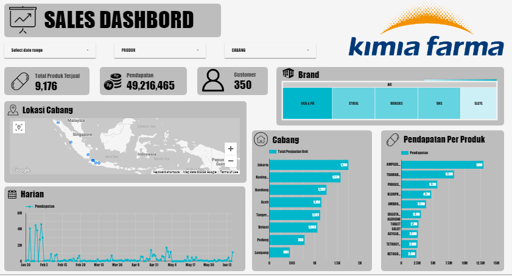

# Big Data Analytics - Kimia Farma
## Work Environment
**Tools** : PostgreSQL 
**Programming Languange** : SQL 
**Visualization** : Google Data Studio
## Introduction
I got the opportunity of a virtual internship experience for 1 month at Kimia Farma, here I was asked to understand Data Lake, Data Warehouse and Data Mart. Then I was asked to also create a data mart to visualize. After the data mart is ready, immediately create a visualization in the form of a Sales Dashboard in Google Data Studio to help analyze the sales line.
## Objective
Create a data mart and then visualize it using Google Data Studio and become a sales dashboard for easy analysis.
## Visualization
if you want to be more interactive click the link [here](https://lookerstudio.google.com/reporting/fa0f021b-ee3d-4789-ad01-a1f8a81c9afd).
